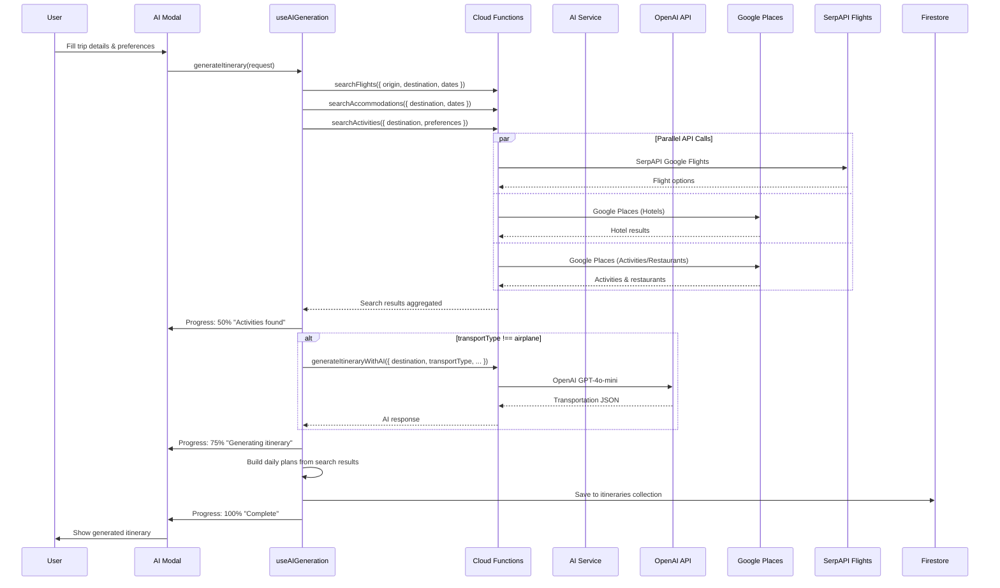

# AI System Architecture - Comprehensive Guide

> **Consolidated Documentation** (January 2025)  
> This document combines architecture, backend contracts, and API reference for AI-powered itinerary generation.
> Updated to reflect actual implementation (not historical specs).

## Overview

This document provides the complete architecture overview for AI-powered itinerary generation in the Voyager app. It covers system diagrams, service architecture, callable function contracts, and technical implementation details.

## High-Level System Architecture

```mermaid
graph TB
    subgraph "Frontend (React Native / React)"
        UI[AIItineraryGenerationModal]
        Hook[useAIGeneration Hook]
        Prefs[useTravelPreferences Hook]
        Progress[Real-time Progress UI]
    end
    
    subgraph "Firebase Authentication"
        Auth[Firebase Auth]
        Premium[Premium Validation]
        RateLimit[Rate Limiting]
    end
    
    subgraph "Firebase Functions Backend"
        Generate[generateItineraryWithAI Function]
        Validate[User Validation]
        DataFetch[Data Fetching]
        APIs[External API Orchestration]
        AI[AI Generation]
        Storage[Platform Storage]
    end
    
    subgraph "External APIs"
        OpenAI[OpenAI GPT-4o-mini]
        Places[Google Places API]
        Flights[SerpAPI Google Flights]
    end
    
    subgraph "Firebase Firestore"
        Users[(users collection)]
        Itineraries[(itineraries collection<br/>ai_status: "completed")]
        Analytics[(ai_analytics collection)]
    end
    
    UI --> Hook
    Hook --> Generate
    Generate --> Auth
    Generate --> Validate
    Validate --> Premium
    Validate --> DataFetch
    DataFetch --> Users
    Generate --> APIs
    APIs --> OpenAI
    APIs --> Places
    APIs --> Flights
    Generate --> AI
    AI --> Storage
    Storage --> Itineraries
    Generate --> Progress
    Progress --> UI
    Storage --> Analytics
```

## Complete Process Flow (6 Stages)

The client-side `useAIGeneration` hook tracks 6 progress stages:
1. **Initializing** (10%) - Setting up generation
2. **Searching** (30%) - Searching flights
3. **Activities** (50%) - Gathering activities
4. **AI Generation** (75%) - Processing with OpenAI
5. **Saving** (90%) - Storing results
6. **Done** (100%) - Complete



---

## Callable Functions (Production)

### 1. generateItineraryWithAI

**Type**: Firebase Callable Function  
**Purpose**: Transportation recommendations when transportType is NOT airplane/flight  
**Called By**: Client after search results are gathered

**Input**:
```typescript
{
  destination: string;           // "Paris, France"
  startDate: string;             // "2025-08-01" (YYYY-MM-DD)
  endDate: string;               // "2025-08-07" (YYYY-MM-DD)
  origin?: string;               // "Atlanta, GA"
  transportType: string;         // "car", "train", etc. (required)
  preferenceProfile?: object;    // User preferences
  generationId?: string;         // Optional tracking ID
  tripType?: string;             // 'leisure' | 'business' | 'adventure' | etc.
  mustInclude?: string[];        // ["Eiffel Tower"]
  mustAvoid?: string[];          // ["Crowded areas"]
}
```

**Output**:
```typescript
{
  success: true;
  data: {
    assistant: string;  // JSON string with transportation recommendations
  }
}
```

**Errors**: `unauthenticated`, `invalid-argument`, `failed-precondition`, `internal`

**Note**: Only called when `transportType !== 'airplane'/'flight'/'air'`. Flight searches use `searchFlights` instead.

---

### 2. searchFlights

**Type**: Firebase Callable Function  
**Purpose**: Search flight options using SerpAPI Google Flights  
**Provider**: SerpAPI (NOT Amadeus)

**Input**:
```typescript
{
  departureAirportCode: string;   // IATA code, e.g., "ATL"
  destinationAirportCode: string; // IATA code, e.g., "CDG"
  departureDate: string;          // "2025-08-01" (YYYY-MM-DD)
  returnDate?: string;            // "2025-08-07" (optional)
  cabinClass?: string;            // "ECONOMY" | "BUSINESS" | "FIRST"
  stops?: string;                 // "NONSTOP" | "ONE_OR_FEWER" | "ANY"
  preferredAirlines?: string[];   // ["DL", "AA", "UA"]
  maxResults?: number;            // Default: 10
}
```

**Output**:
```typescript
{
  success: true;
  flights: Flight[];  // Array of flight options
}
```

---

### 3. searchAccommodations

**Type**: Firebase Callable Function  
**Purpose**: Search hotels using Google Places API

**Input**:
```typescript
{
  destination: string;              // "Paris, France"
  destinationLatLng?: {             // Optional but RECOMMENDED for accuracy
    lat: number;
    lng: number;
  };
  startDate: string;
  endDate: string;
  accommodationType?: string;       // "hotel" | "hostel" | "apartment"
  starRating?: number;              // 3, 4, 5
  minUserRating?: number;           // 4.0
  accessibility?: boolean;
  maxResults?: number;
}
```

**Output**:
```typescript
{
  success: true;
  hotels: Hotel[];
}
```

---

### 4. searchActivities

**Type**: Firebase Callable Function  
**Purpose**: Search activities and restaurants using Google Places API

**Input**:
```typescript
{
  destination: string;              // "Naples, Italy"
  destinationLatLng?: {             // ⚠️ CRITICAL: Often undefined, causes Naples bug
    lat: number;
    lng: number;
  };
  keywords?: string[];              // ["art museum", "hiking"]
  days?: number;                    // Trip length
  tripType?: string;                // 'leisure' | 'adventure' | etc.
  mustInclude?: string[];
  mustAvoid?: string[];
  specialRequests?: string;
  food?: object;                    // Dietary preferences
}
```

**Output**:
```typescript
{
  success: true;
  activities: Activity[];
  restaurants: Restaurant[];
  metadata?: {
    filtering: object;  // Debugging info
  }
}
```

⚠️ **Known Issue**: When `destinationLatLng` is undefined, Google Places uses text search only, which can return wrong geographic results (e.g., "Naples" returns Florida instead of Italy).

---

## Non-Existent Functions

> ⚠️ **These functions are documented in older specs but do NOT exist**:
> - `estimateItineraryCost` - Never implemented
> - `getGenerationStatus` - Never implemented (progress tracked client-side only)

---

## Environment Setup

### Required API Keys

```bash
# OpenAI Configuration (REQUIRED)
export OPENAI_API_KEY="sk-your-openai-api-key"

# Google Places API (REQUIRED)
export GOOGLE_PLACES_API_KEY="your-google-places-api-key"

# SerpAPI for Flight Search (REQUIRED)
export SERPAPI_API_KEY="your-serpapi-api-key"
```

### Firebase Configuration

```bash
firebase functions:config:set openai.api_key="your-key"
firebase functions:config:set google.places_api_key="your-key"
firebase functions:config:set serpapi.api_key="your-key"
```

---

## Database Schema

### itineraries Collection

Primary storage for AI-generated itineraries.

```typescript
/itineraries/{id}
{
  id: string;
  userId: string;
  destination: string;
  startDate: string;
  endDate: string;
  ai_status: 'pending' | 'processing' | 'completed' | 'failed';
  
  request: {
    // Original generation request
    destination: string;
    startDate: string;
    endDate: string;
    tripType?: string;
    mustInclude?: string[];
    mustAvoid?: string[];
    // ... other request params
  };
  
  progress?: {
    stage: string;
    percent?: number;
    message?: string;
  };
  
  response?: {
    data: {
      // Generated itinerary data
      dailyPlans: DailyPlan[];
      flights?: Flight[];
      hotels?: Hotel[];
      metadata?: {
        filtering: object;
      };
    };
  };
  
  generationMetadata?: {
    generationId?: string;
    promptVersion?: string;
    model?: string;
  };
  
  processingTimeMs?: number;
  createdAt: Timestamp;
  updatedAt: Timestamp;
  errorDetails?: any;
}
```

### ai_analytics Collection

Daily analytics for monitoring.

```typescript
/ai_analytics/{date}
{
  date: string;                    // "2025-01-24"
  totalGenerations: number;
  successfulGenerations: number;
  failedGenerations: number;
  averageProcessingTime: number;
  popularDestinations: string[];
  commonFailureReasons: string[];
}
```

---

## Client-Side Architecture

### useAIGeneration Hook

The main orchestration hook that coordinates API calls and builds the itinerary.

```typescript
// Usage
const { 
  generateItinerary, 
  progress, 
  error, 
  loading,
  generatedItinerary 
} = useAIGeneration();

// Trigger generation
await generateItinerary({
  destination: "Paris, France",
  startDate: "2025-08-01",
  endDate: "2025-08-07",
  tripType: "leisure",
  originAirportCode: "ATL",
  destinationAirportCode: "CDG"
});
```

### Key Files (React Native)

- `src/hooks/useAIGeneration.ts` - Main orchestration hook
- `src/components/modals/AIItineraryGenerationModal.tsx` - UI component
- `src/types/AIGeneration.ts` - TypeScript interfaces

### Key Files (PWA - Reference)

- `src/hooks/useAIGeneration.ts` - Original hook
- `src/hooks/buildAIPayload.ts` - Payload construction
- `src/hooks/orchestrateAICalls.ts` - API orchestration

---

## Error Handling

### Error Codes

| Code | Description |
|------|-------------|
| `unauthenticated` | User not logged in |
| `permission-denied` | Premium subscription required |
| `invalid-argument` | Invalid request parameters |
| `resource-exhausted` | Rate limit exceeded |
| `not-found` | Resource not found |
| `internal` | Internal server error |

### Rate Limiting

- **Premium Users**: 10 AI generations per hour
- **Free Users**: Full generation blocked (premium feature)
- Enforced server-side with client-side UI feedback

---

## Cost Analysis

### Current API Costs Per Generation

| API | Cost |
|-----|------|
| Google Places (TextSearch) | ~$0.032 per request |
| Google Places (Details) | ~$0.017 per place |
| SerpAPI (Flights) | ~$0.05 per search |
| OpenAI GPT-4o-mini | ~$0.15 (input) + $0.60 (output) per 1M tokens |

**Estimated Total**: ~$0.29 per generation

### Cost Optimization Implemented

- Using GPT-4o-mini (vs GPT-4) - 10x cheaper
- 5-minute search cache - reduces repeat API calls
- Parallel API calls - faster completion, same cost
- Fallback mechanisms - prevent wasted retries

---

## Deployment

```bash
# Deploy all functions
firebase deploy --only functions

# Deploy specific function
firebase deploy --only functions:generateItineraryWithAI
firebase deploy --only functions:searchFlights
firebase deploy --only functions:searchAccommodations
firebase deploy --only functions:searchActivities

# Check logs
firebase functions:log --only generateItineraryWithAI
```

---

## Testing

### Local Development

```bash
# Start Firebase emulators
cd functions && npm run build && firebase emulators:start --only functions,firestore,auth

# Run frontend
npm start
```

### Test Endpoints

```bash
# Test searchFlights
curl -X POST "http://localhost:5001/mundo1-dev/us-central1/searchFlights" \
  -H "Content-Type: application/json" \
  -d '{"data":{"departureAirportCode":"ATL","destinationAirportCode":"CDG","departureDate":"2025-08-01","returnDate":"2025-08-07"}}'

# Test searchActivities
curl -X POST "http://localhost:5001/mundo1-dev/us-central1/searchActivities" \
  -H "Content-Type: application/json" \
  -d '{"data":{"destination":"Paris, France","days":7,"tripType":"leisure"}}'
```

---

## Known Issues & Planned Improvements

### Current Issues

1. **Naples Bug**: `destinationLatLng` is often undefined, causing Google Places to return wrong geographic results
   - **Fix**: Require coordinates from destination picker
   - **Status**: Documented in [AI_ENRICHMENT_ROADMAP.md](AI_ENRICHMENT_ROADMAP.md)

2. **Limited Preference Utilization**: User preferences (travel style, food restrictions) are collected but minimally used in search queries

3. **No Real-Time Weather**: Weather API was planned but never implemented

### Planned Enrichment (Phase 1-4)

See [AI_ENRICHMENT_ROADMAP.md](AI_ENRICHMENT_ROADMAP.md) for the complete improvement plan.

---

## Summary

| Feature | Status |
|---------|--------|
| Single Function Orchestration | ✅ Implemented |
| Real-time Progress Tracking | ✅ 6-stage process |
| Parallel API Processing | ✅ ~30-40s total |
| Google Places Integration | ✅ Activities + Hotels |
| SerpAPI Flight Search | ✅ Working |
| OpenAI Transportation | ✅ Non-flight transport |
| Rate Limiting | ✅ 10/hour premium |
| Error Recovery | ✅ Fallbacks |
| Weather Integration | ❌ Not implemented |
| Cost Estimation | ❌ Not implemented |
| Location Disambiguation | ❌ Bug exists |
