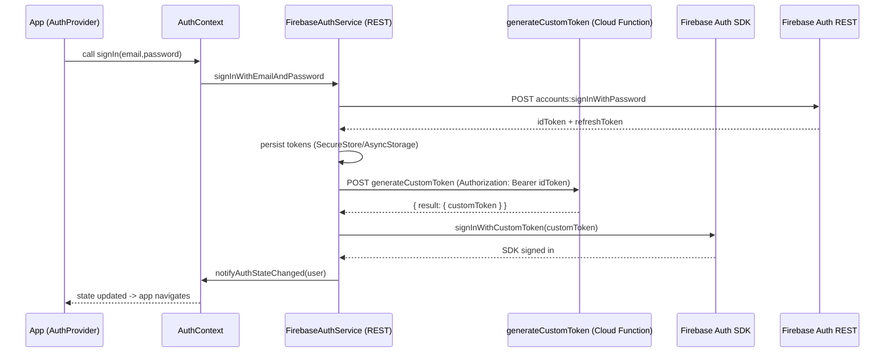

**AuthContext Explained**

This document explains the `AuthContext` implementation used in this project. It's written for beginner developers and consolidates details from the code and the existing docs in `docs/auth`.

**What it is:**
- `AuthContext` is a React Context provider located at `src/context/AuthContext.tsx` that exposes authentication state and helper methods to the app via the `useAuth()` hook.

**Why this approach:**
- The mobile Expo environment uses a Firebase REST API service instead of the Firebase Web SDK for sign-in/sign-up because of compatibility issues with some Expo/React Native versions. The project provides `FirebaseAuthService` (in `src/services/auth/FirebaseAuthService.ts`) which implements REST calls to Firebase Auth endpoints and manages token storage.

**High-level responsibilities of `AuthContext`:**
- Maintain a `user` object (type `FirebaseUser | null`) representing the currently signed-in user.
- Maintain `status` and `isInitializing` flags for UI state and loading indicators.
- Provide actions: `signIn`, `signUp`, `signOut`, `sendPasswordReset`, `resendVerification`, `refreshAuthState`, `hasUnverifiedUser`, and stubbed Google sign-in helpers.
- Subscribe to `FirebaseAuthService.onAuthStateChanged` to reactively update UI when the service updates auth state.

AuthContext core state
- `user: FirebaseUser | null` — the current authenticated user (data from the REST service and token storage).
- `status: 'idle'|'loading'|'authenticated'|'error'` — UI friendly status to drive spinners and alerts.
- `isInitializing: boolean` — indicates whether initial session restore is in progress.

Key methods (what they do and where they delegate):
- `signIn(email, password)`
  - On web: delegates to the firebase/web SDK `signInWithEmailAndPassword` (so tests & web behavior remain compatible).
  - On mobile: calls `FirebaseAuthService.signInWithEmailAndPassword` which POSTs to `accounts:signInWithPassword` and then persists tokens.
  - After successful REST sign-in, `FirebaseAuthService` calls `syncWithAuthSDK` to create/sign-in a custom token for the Firebase Web SDK (so Cloud Functions / httpsCallable calls use normal SDK auth). AuthContext updates its `status` and relies on `onAuthStateChanged` for final user object update.

- `signUp(username, email, password)`
  - On web: uses firebase/web `createUserWithEmailAndPassword`.
  - On mobile: uses `FirebaseAuthService.createUserWithEmailAndPassword` (REST `accounts:signUp`). The service returns a user object but does not persist unverified users.
  - After creating the user, `AuthContext` calls `UserProfileService.createUserProfile` (Cloud Function) to create an application profile in Firestore (this avoids Firestore rules complications). Then it sends a verification email using either the web SDK helper or `FirebaseAuthService.sendEmailVerification`.

- `signOut()`
  - Calls `FirebaseAuthService.signOut()` which removes tokens from `expo-secure-store` (mobile) or AsyncStorage (web) and clears non-sensitive keys from AsyncStorage.
  - Also attempts to sign out of the Firebase Auth SDK for web/mobile where available but does not rely on this to clear REST tokens.

- `sendPasswordReset(email)` and `resendVerification()`
  - Use REST API endpoints (`sendOobCode`) via `FirebaseAuthService` on mobile and the firebase/web SDK helpers on web.

- `refreshAuthState()`
  - Forces token refresh by calling `FirebaseAuthService.getIdToken(true)` which triggers `refreshToken` if needed and re-initializes the stored user state.

- `hasUnverifiedUser()`
  - Simple helper to let UI check if `user` exists and `user.emailVerified` is false.

How the initial restore works (startup sequence)
1. `AuthProvider` mounts and calls `FirebaseAuthService.initialize()`.
2. `FirebaseAuthService` attempts to read non-sensitive data from `AsyncStorage` (uid, email) and tokens from `SecureStore` (mobile) or `AsyncStorage` (web).
3. If tokens exist and are not expired, the service calls `syncWithAuthSDK(idToken)` to obtain a custom token via the `generateCustomToken` Cloud Function and signs in the Firebase Auth SDK with that custom token. This step ensures the firebase JS SDK has the signed-in user and credential so `httpsCallable` calls attach the auth context.
4. After sync (or after several retries), `FirebaseAuthService` notifies listeners via `onAuthStateChanged` and AuthContext updates the `user` and `status`.

Platform differences you must know
- Storage:
  - Mobile (Expo): sensitive tokens (`FIREBASE_ID_TOKEN`, `FIREBASE_REFRESH_TOKEN`) are stored in `expo-secure-store` (encrypted), non-sensitive data lives in `@react-native-async-storage/async-storage`.
  - Web: `SecureStore` isn't available, so tokens fall back to AsyncStorage (less secure) — this is why the code uses the firebase/web SDK for web paths where possible.
- Sign-in methods:
  - Web: uses firebase/web SDK methods in a few places to enable tests and browser flows.
  - Mobile: uses REST API endpoints only, with a follow-up `syncWithAuthSDK` via Cloud Function to sign-in the SDK.
  - Google Sign-In (mobile): implemented using `@react-native-google-signin/google-signin`. The mobile flow:
    1) Native Google Sign-In returns an `idToken`.
    2) The app POSTs the `idToken` to Firebase Auth REST `accounts:signInWithIdp` (`FirebaseAuthService.signInWithGoogleIdToken`).
    3) The service persists the returned `idToken`/`refreshToken` in secure storage and calls `syncWithAuthSDK` (generateCustomToken CF + `signInWithCustomToken`) to ensure SDK-based calls (httpsCallable) have proper auth context.
    4) If the account is new (`isNewUser`), the app may create a Firestore profile via Cloud Function (the AuthContext `signUpWithGoogle` helper does this).

Security features and concerns
- Good:
  - Tokens are stored in `expo-secure-store` on mobile — this reduces risk of token theft on physical devices.
  - Refresh token is used to rotate tokens via the securetoken endpoint; expired/invalid refresh tokens cause `signOut()` to run.
  - The code purposely waits for the `syncWithAuthSDK` flow to complete before notifying listeners. This prevents race conditions where UI or functions call secure Cloud Functions without the Auth SDK being signed-in.
- Concerns / areas to review:
  - API key exposure: `API_KEY` and full firebase config are present in the repo — this is normal for frontend Firebase usage (API keys are not secrets), but you should still restrict Cloud Function and Firestore rules appropriately.
  - `syncWithAuthSDK` calls a Cloud Function endpoint with `Authorization: Bearer <idToken>` header. Ensure that Cloud Function validates the incoming token server-side and limits the allowed operations.
  - On web, tokens fall back to AsyncStorage and are therefore less protected; be careful when running web builds in untrusted environments.
  - The `generateCustomToken` cloud function should be rate-limited and validate callers to avoid token forging or abuse.
  - Storing token expiry as a Unix ms value in AsyncStorage is fine, but edge cases around device clock skew could cause premature expiry; consider validating expiry against token claims when needed.

Quick reference — files to inspect
- `src/context/AuthContext.tsx` — the React provider you use in UI.
- `src/services/auth/FirebaseAuthService.ts` — REST API implementation and token storage/sync logic.
- `src/services/userProfile/UserProfileService.ts` — wrapper for Cloud Functions that create/read profiles.
- `src/config/firebaseConfig.ts` — firebase SDK initialization used by the web SDK paths and the functions/firestore clients.

Beginner checklist: common flows
- Sign up (mobile): `AuthPage` -> `signUp` -> `FirebaseAuthService.createUserWithEmailAndPassword` -> `UserProfileService.createUserProfile` -> `FirebaseAuthService.sendEmailVerification` -> show success.
- Login (mobile): `AuthPage` -> `signIn` -> `FirebaseAuthService.signInWithEmailAndPassword` -> `syncWithAuthSDK` -> `onAuthStateChanged` -> app navigates to authenticated area.
- Password reset: `AuthPage` -> `sendPasswordReset` -> `FirebaseAuthService.sendPasswordResetEmail`.
- Logout: `AuthPage` -> `signOut` -> `FirebaseAuthService.signOut` (clears SecureStore/AsyncStorage) -> `onAuthStateChanged` called with `null`.

Flow diagram (mermaid) — Login sequence (mobile)

ASCII fallback — login sequence (mobile)

1. UI calls `signIn(email,password)` on the context
2. Context calls `FirebaseAuthService.signInWithEmailAndPassword`
3. Service POSTs to Firebase REST `accounts:signInWithPassword`
4. Firebase returns idToken + refreshToken
5. Service persists tokens (SecureStore on mobile)
6. Service POSTs `idToken` to Cloud Function `generateCustomToken`
7. Cloud Function returns a `customToken` signed by server credentials
8. Service calls `signInWithCustomToken` on the firebase SDK
9. After SDK sign-in, the service calls `notifyAuthStateChanged`

What to read next (practical)
- Read `src/services/auth/FirebaseAuthService.ts` to understand token persistence and `syncWithAuthSDK`.
- Read `src/context/AuthContext.tsx` to see how UI components call the service and react to `onAuthStateChanged`.
- Read `docs/auth/README.md` (existing) for project-specific context where needed.

If you'd like, I can also:
- Add inline diagrams inside `src/context/AuthContext.tsx` as code comments to help future devs.
- Add unit-test suggestions and example tests for `FirebaseAuthService` flows.

---
Document created by automation: consolidated from code and `docs/auth` materials.
