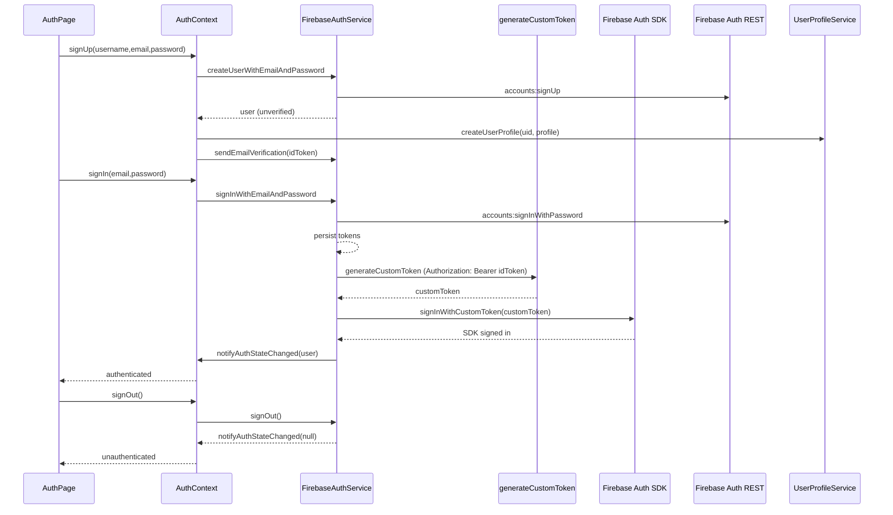

**Auth Flow — Code Review & Junior Engineer Guide**

This document is a comprehensive code review of the authentication flow: signup → login → logout (mobile-first with web differences). It is intended to teach junior engineers how the implementation works, point out important details, and give suggestions for improvements and tests.

Files of interest
- `src/context/AuthContext.tsx` — main React provider. Hooks into `FirebaseAuthService` and exposes actions to UI.
- `src/services/auth/FirebaseAuthService.ts` — REST API wrapper that manages tokens, persistence, and SDK sync.
- `src/services/userProfile/UserProfileService.ts` — Cloud Functions wrapper for profile operations.
- `src/config/firebaseConfig.ts` — SDK initialization and `getFunctions()` target region.
- `src/pages/AuthPage.tsx` and `src/components/auth/forms/*` — UI components that call the context.

High-level flow review (step-by-step)

1) Sign up (mobile)
  - UI: `AuthPage` calls `signUp(username,email,password)`.
  - Context: `signUp` in `AuthContext` calls `FirebaseAuthService.createUserWithEmailAndPassword`.
  - REST: `createUserWithEmailAndPassword` POSTs to `accounts:signUp` endpoint and returns an object with `idToken`/`refreshToken` but marks `emailVerified: false`.
  - Profile: `AuthContext` calls `UserProfileService.createUserProfile` (Cloud Function) passing `newUser.uid` and a minimal profile payload.
  - Verify: `AuthContext` triggers a verification email — on mobile it calls `FirebaseAuthService.sendEmailVerification(idToken)` (REST `sendOobCode`).

  Notes / issues:
  - The service does not persist unverified users to storage (good). Only after verification/login the tokens will be persisted.
  - The UI shows a success message and returns to login; this matches typical flows.

2) Email verification
  - The verification email is a standard Firebase “verify email” OOB link.
  - The user clicks link in email; when they return and attempt to login, `getUserData(idToken)` is used to check `emailVerified`.

3) Login (mobile)
  - UI: `AuthPage` calls `signIn(email,password)`.
  - Context: calls `FirebaseAuthService.signInWithEmailAndPassword`.
  - REST: Service POSTs to `accounts:signInWithPassword`. On success it calls `getUserData(idToken)` and ensures `emailVerified` is true; otherwise throws.
  - Persist: `persistUser` stores `idToken` and `refreshToken` in `expo-secure-store` (mobile) and stores `uid`, `email`, and expiry in AsyncStorage.
  - Sync: `syncWithAuthSDK(idToken)` posts the idToken to the `generateCustomToken` Cloud Function which returns a server-side `customToken`. The service signs in the Firebase Auth SDK with `signInWithCustomToken(customToken)`.
  - Notify: after SDK sign-in, the service calls `notifyAuthStateChanged(user)`; `AuthContext` updates UI and navigation.

6) Google Sign-In / Sign-Up (mobile)
  - UI: user taps the Google sign-in button which calls `AuthContext.signInWithGoogle` or `signUpWithGoogle`.
  - Context (mobile): `AuthContext` uses `@react-native-google-signin/google-signin` to show the native Google auth flow and obtain an `idToken`.
  - Service: `FirebaseAuthService.signInWithGoogleIdToken(idToken)` POSTs to `accounts:signInWithIdp?key=API_KEY` with `postBody=id_token=<idToken>&providerId=google.com`.
  - Persist & Sync: The service persists tokens in `expo-secure-store`, then calls `syncWithAuthSDK` to obtain a server-signed `customToken` and signs into the Firebase Auth SDK so that Cloud Functions / httpsCallable have the proper auth context.
  - New user handling: If the REST response indicates `isNewUser=true`, `AuthContext.signUpWithGoogle` creates a user profile via `UserProfileService.createUserProfile` to mirror the email sign-up flow.

  Notes / issues:
  - The mobile Google flow uses native sign-in for UX and security. The `idToken` obtained from Google is exchanged with Firebase REST API to obtain Firebase tokens that the app persists.
  - `syncWithAuthSDK` is still required to allow httpsCallable to include auth context; failures in this step are logged but do not block the REST auth session.

  Notes / issues:
  - The code implements retries with exponential backoff when calling the CF to create a custom token — good for robustness.
  - `syncWithAuthSDK` swallows final failures: it logs errors but does not fail the sign-in flow. This is an intentional tradeoff (REST auth still works) but should be documented for maintainers.
  - Because SDK sync is awaited before notifying listeners, callers of httpsCallable will have proper auth context — this avoids race conditions.

4) Token refresh
  - `getIdToken(forceRefresh)` checks expiry and calls `refreshToken(refreshToken)` when needed.
  - `refreshToken` calls `https://securetoken.googleapis.com/v1/token` with grant_type `refresh_token` and rotates `id_token` and `refresh_token` on success, then persists new tokens and notifies listeners.

  Notes / issues:
  - If refresh fails, the code signs out the user — this is correct to avoid using bad tokens.
  - The expiry calculation uses `expiresIn` and the device's clock. Consider parsing the JWT expiry claim to make expiry independent of device clock skew.

5) Sign out
  - `FirebaseAuthService.signOut` clears AsyncStorage and SecureStore values and notifies listeners with `null`.
  - `AuthContext.signOut` also attempts to sign out of the firebase SDK where available (web paths) as a best-effort sync.

Security review and recommendations
- Token storage
  - Mobile: uses `expo-secure-store` — good.
  - Web: falls back to AsyncStorage — insecure; consider using cookie-based HttpOnly tokens or instruct devs that web builds are less secure via this path.

- API key exposure
  - Firebase API keys and project config are public in the frontend repo; this is expected for Firebase apps, but security must be enforced server-side with strong Firestore rules and Cloud Functions checks.

- Cloud Function `generateCustomToken`
  - This function must validate the incoming `idToken` (verify it with the Admin SDK) and reject invalid or expired tokens.
  - Rate-limit and monitor this endpoint to prevent abuse; custom token issuance is a sensitive operation.

- Email verification and malicious sign-ups
  - The code enforces email verification before allowing sign-in — good.
  - Consider adding reCAPTCHA or other bot mitigations if significant automated sign-up abuse is expected.

- Error messages
  - Error messages originating from Firebase REST responses are thrown as `Error(error.error?.message)` (these are Firebase machine messages like `EMAIL_NOT_FOUND`). `AuthPage` maps known codes to friendly messages; ensure mapping covers common localized messages.

Operational notes and tests
- Unit tests exist in `src/__tests__/services/FirebaseAuthService.test.ts` and should be kept up to date. Tests already cover initialize, signIn, refresh logic and mock network responses.
- Integration tests should verify `syncWithAuthSDK` happy path and CF failures. Create a test variant of the `generateCustomToken` CF or mock its network call.

Potential improvements (prioritized)
1. Use JWT `exp` claim instead of device clock + `expiresIn` to determine expiry.
2. Add an assertion in the Cloud Function to ensure the `Authorization` header contains a valid idToken (verify with Admin SDK) and restrict which callers can request custom tokens.
3. On web, clearly document security differences and consider using different auth flows (web SDK only) where possible.
4. Add telemetry/metrics for failed `syncWithAuthSDK` attempts (so we know when users lose function auth context).
5. Add a small helper to centralize friendly error mapping from Firebase REST error codes to UI strings (reduces duplication in `AuthPage`).

Developer checklist for changes
- If you change token storage keys, update `persistUser`, `initialize`, and any tests that mock storage keys.
- If you change the Cloud Function URL or contract, update `syncWithAuthSDK` and add tests that mock the new contract.

Diagrams

Signup/login/logout (sequence) — mermaid

Common pitfalls for junior engineers
- Do not attempt to call `httpsCallable` functions immediately after `signInWithEmailAndPassword` without waiting for `onAuthStateChanged` — the code correctly avoids that by waiting for SDK sync.
- Avoid persisting tokens yourself — always call `persistUser` or the service helper so tokens are encrypted on mobile.
- When adding new auth flows (e.g., Apple Sign-In), follow the same pattern: REST/native sign-in -> persist tokens -> sync with Auth SDK (if needed) -> notify listeners.

Summary
- The current implementation is robust and pragmatic: it uses REST auth for compatibility, secures tokens on mobile, and synchronizes the Firebase SDK for function compatibility.
- The most important operational items are Cloud Function validation and careful handling of web token storage security.

If you'd like, I can:
- Create unit test templates for the missing edge-cases.
- Add a monitoring/metric stub for failed `syncWithAuthSDK` attempts.

---
Document created by automation: code review derived from repository sources.
