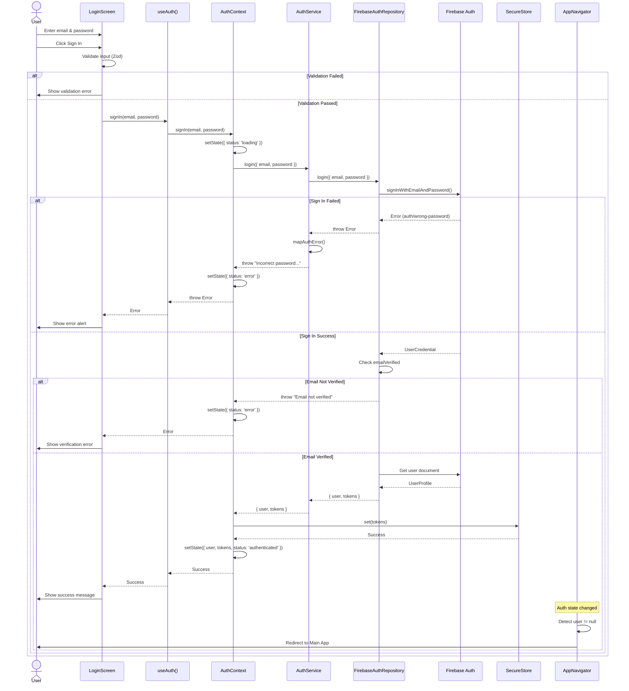
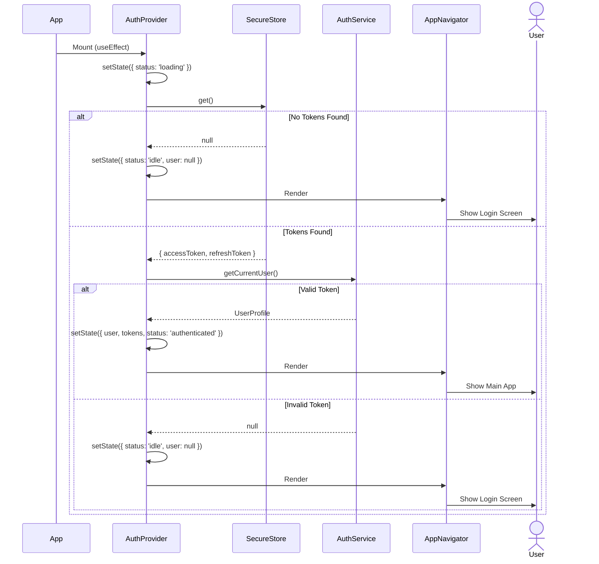
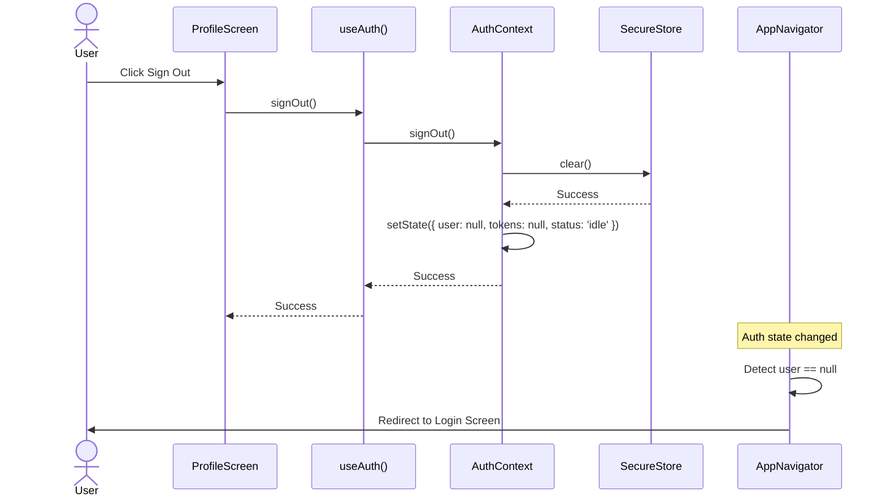
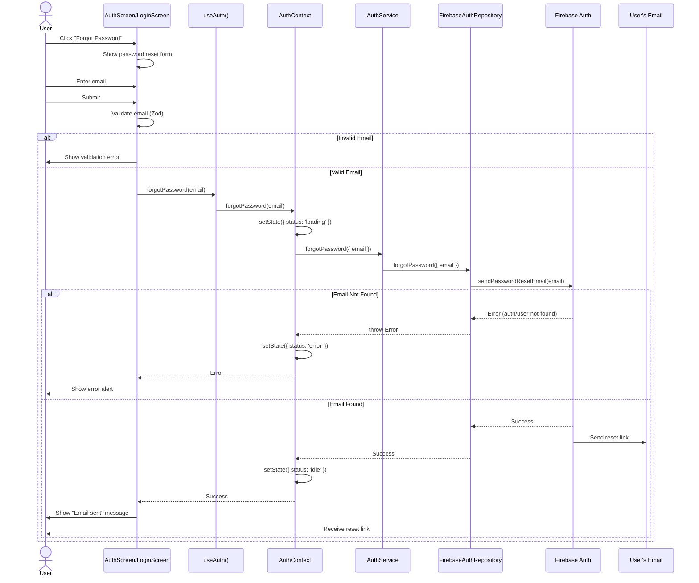
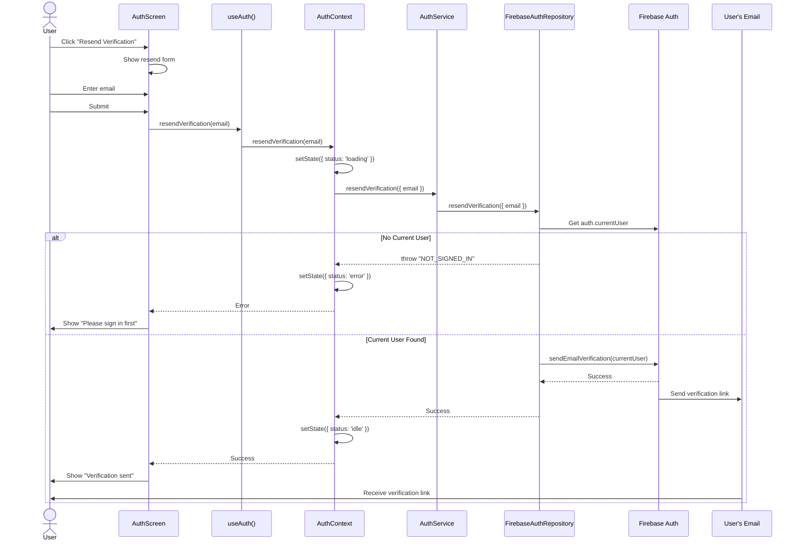
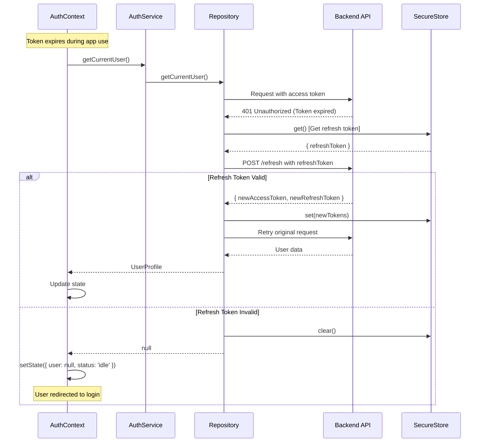
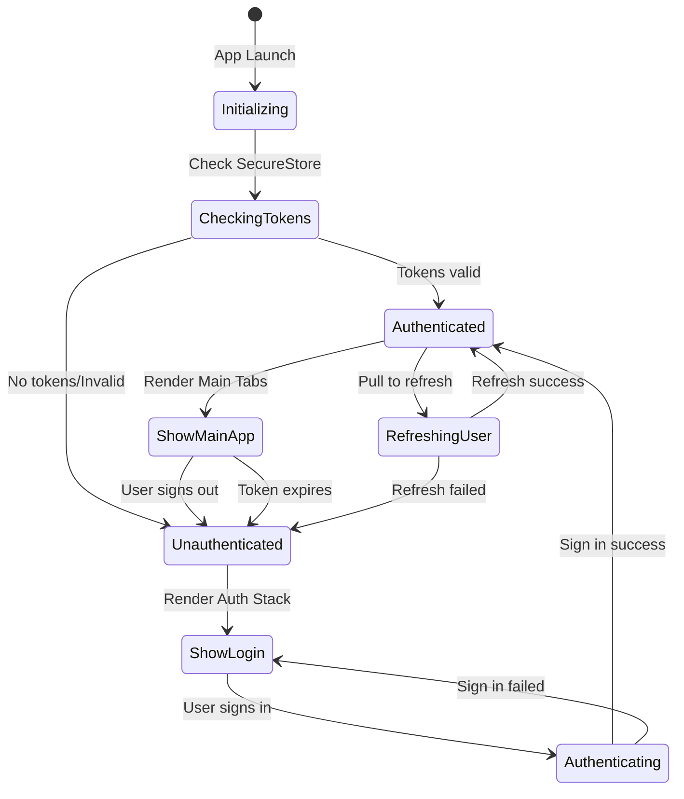
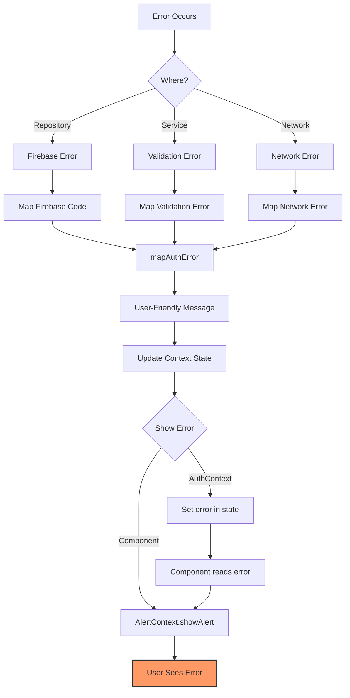
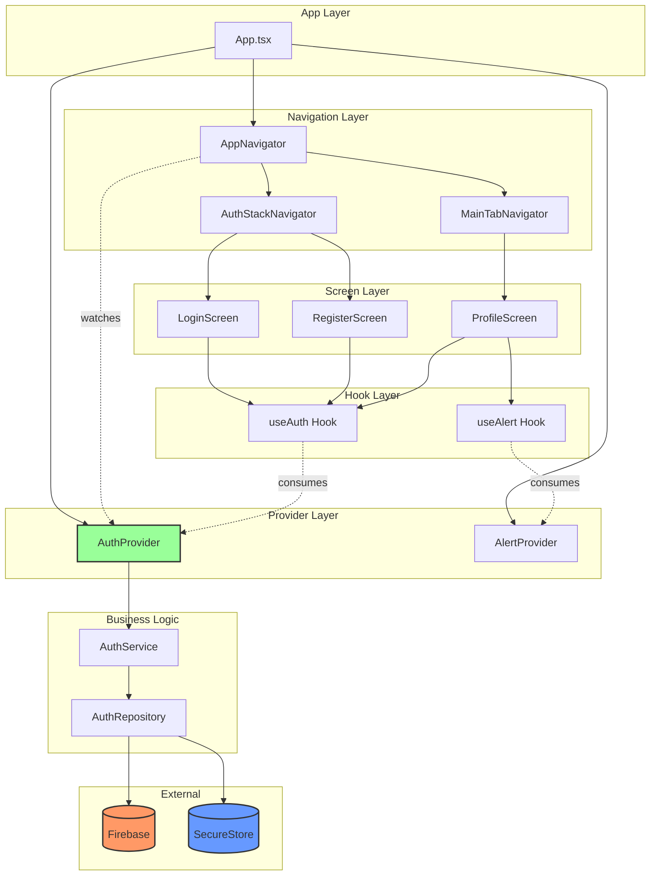

# Authentication Sequence Diagrams

## 1. Sign In Flow (Detailed)



---

## 2. App Initialization Flow



---

## 3. Sign Out Flow



---

## 4. Forgot Password Flow



---

## 5. Email Verification Resend Flow



---

## 6. Token Refresh Flow (Future Enhancement)



---

## 7. Navigation State Machine



---

## 8. Error Handling Flow



---

## 9. Component Communication Pattern



---

## 10. Data Flow Diagram

```
┌─────────────────────────────────────────────────────────────┐
│                        USER ACTION                           │
│                  (Click Sign In Button)                      │
└────────────────────────┬────────────────────────────────────┘
                         │
                         ▼
            ┌────────────────────────┐
            │   LoginScreen.tsx      │
            │   - Validate inputs    │
            │   - Call useAuth()     │
            └────────────┬───────────┘
                         │
                         ▼
            ┌────────────────────────┐
            │   useAuth() Hook       │
            │   - Access context     │
            │   - Return methods     │
            └────────────┬───────────┘
                         │
                         ▼
            ┌────────────────────────┐
            │   AuthContext          │
            │   - Manage state       │
            │   - Call service       │
            └────────────┬───────────┘
                         │
                         ▼
            ┌────────────────────────┐
            │   AuthService          │
            │   - Business logic     │
            │   - Error mapping      │
            └────────────┬───────────┘
                         │
                         ▼
            ┌────────────────────────┐
            │   AuthRepository       │
            │   - Data access        │
            │   - Firebase calls     │
            └────────────┬───────────┘
                         │
            ┌────────────┴────────────┐
            │                         │
            ▼                         ▼
┌───────────────────┐     ┌──────────────────┐
│  Firebase Auth    │     │  SecureStore     │
│  - Authenticate   │     │  - Store tokens  │
│  - Get user data  │     │  - Encrypted     │
└───────────┬───────┘     └────────┬─────────┘
            │                      │
            └──────────┬───────────┘
                       │
                       ▼
            ┌────────────────────────┐
            │   AuthContext          │
            │   - Update state       │
            │   - user: {...}        │
            │   - status: 'auth'     │
            └────────────┬───────────┘
                         │
                         ▼
            ┌────────────────────────┐
            │   AppNavigator         │
            │   - Detect state       │
            │   - Conditional render │
            └────────────┬───────────┘
                         │
                         ▼
            ┌────────────────────────┐
            │   MainTabNavigator     │
            │   - Search             │
            │   - Videos             │
            │   - Chat               │
            │   - Profile            │
            └────────────────────────┘
```

---

**Note**: These diagrams show the complete authentication flow including all success and error paths. The actual implementation follows these patterns exactly as documented in the [Authentication Flow](./README.md) documentation.

**Tools Used**: 
- Mermaid.js for sequence diagrams
- ASCII art for data flow

**See Also**:
- [Authentication Flow Overview](./README.md)
- [API Reference](./API.md)
- [Testing Documentation](../../TESTING.md)
